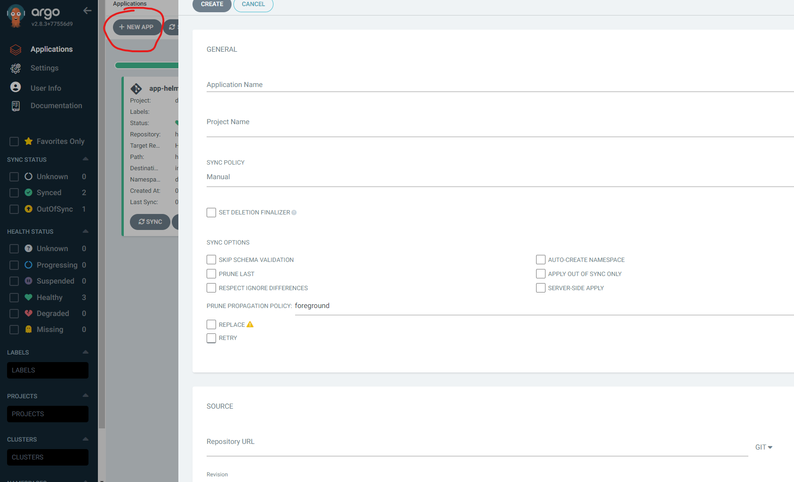
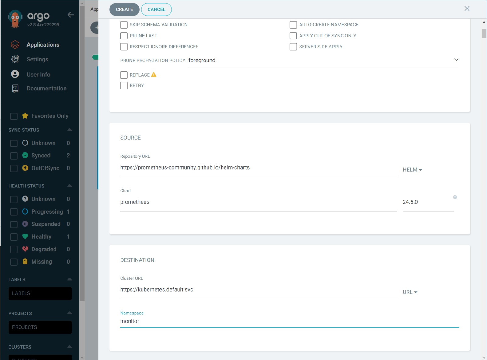
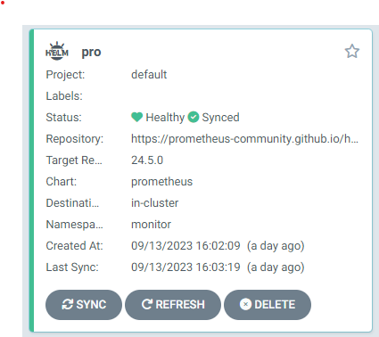
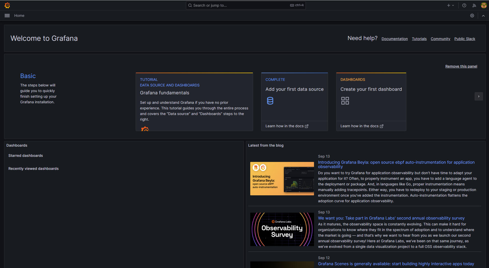
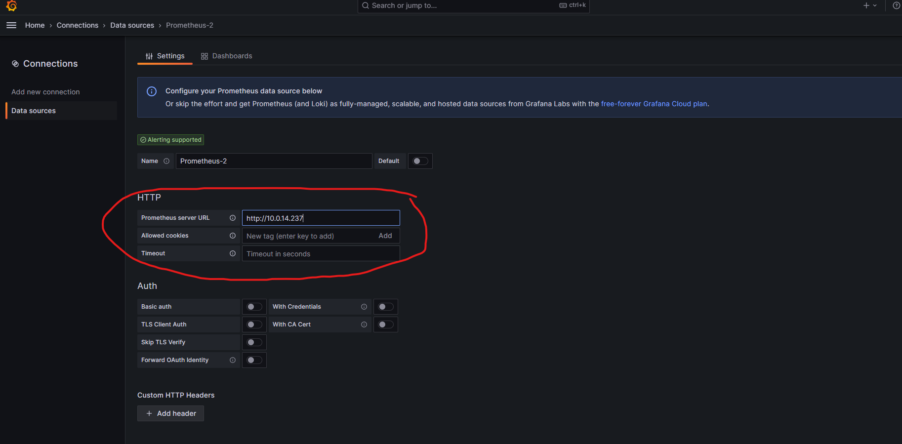
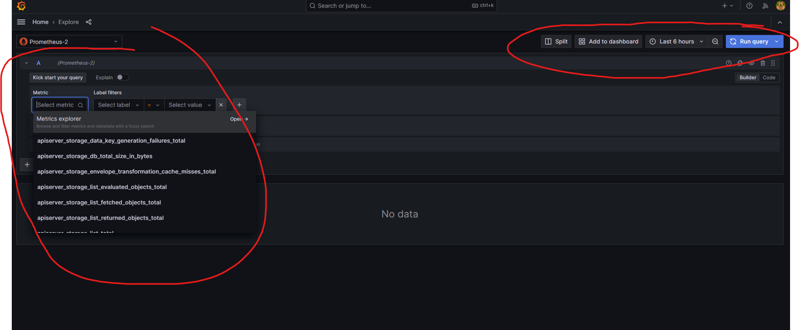

## install prometheus and grafana instance on Kubernetes

### Requirements
- ArgoCd
 
### prometheus Installation

In your cluster run:

```
kubectl create ns monitor
```
This command will create a namespace called "monitor" in the cluster that we will use later on in this deployment

After loging in to the argo UI, click the "+ NEW APP" on the top left
and fill in the following fields:


<b>application name</b>: prometheus \
<b>project name</b>: default \
<b>source</b>: Change the source to HELM and paste this [link](https://prometheus-community.github.io/helm-charts) \
<b>Chart</b>: prometheus \
<b>cluster URL</b>: It will autofill the cluster that argo is running on \
<b>Namespace</b>: monitor



After filling all the required fields, you can click "sync" on the created window.



To see your pods, pvc's, svc etc., you can click on the main window and get a diagram
that fully shows the relations of the different resources. 

### Grafana Installation

Based on this [guide](https://grafana.com/docs/grafana/latest/setup-grafana/installation/kubernetes/)

create deployment yaml
```
nano grafana.yaml
```
Copy the following text and make sure the namespace is monitor and not 'grafana'/
(We want it to be the same as prometheus)
yaml
```
---
apiVersion: v1
kind: PersistentVolumeClaim
metadata:
  name: grafana-pvc
spec:
  accessModes:
    - ReadWriteOnce
  resources:
    requests:
      storage: 1Gi
---
apiVersion: apps/v1
kind: Deployment
metadata:
  labels:
    app: grafana
  name: grafana
spec:
  selector:
    matchLabels:
      app: grafana
  template:
    metadata:
      labels:
        app: grafana
    spec:
      securityContext:
        fsGroup: 472
        supplementalGroups:
          - 0
      containers:
        - name: grafana
          image: grafana/grafana:latest
          imagePullPolicy: IfNotPresent
          ports:
            - containerPort: 3000
              name: http-grafana
              protocol: TCP
          readinessProbe:
            failureThreshold: 3
            httpGet:
              path: /robots.txt
              port: 3000
              scheme: HTTP
            initialDelaySeconds: 10
            periodSeconds: 30
            successThreshold: 1
            timeoutSeconds: 2
          livenessProbe:
            failureThreshold: 3
            initialDelaySeconds: 30
            periodSeconds: 10
            successThreshold: 1
            tcpSocket:
              port: 3000
            timeoutSeconds: 1
          resources:
            requests:
              cpu: 250m
              memory: 750Mi
          volumeMounts:
            - mountPath: /var/lib/grafana
              name: grafana-pv
      volumes:
        - name: grafana-pv
          persistentVolumeClaim:
            claimName: grafana-pvc
---
apiVersion: v1
kind: Service
metadata:
  name: grafana
spec:
  ports:
    - port: 3000
      protocol: TCP
      targetPort: http-grafana
  selector:
    app: grafana
  sessionAffinity: None
  type: LoadBalancer
```
Run the following command to send the manifest to the Kubernetes API server:
```
kubectl apply -f grafana.yaml --namespace=monitor
```

Complete the following steps to verify the deployment status of each object.

a. For PVC, run the following command:

```
kubectl get pvc --namespace=monitor -o wide
```
b. For Deployment, run the following command:
```
kubectl get deployments --namespace=monitor -o wide
```

c. For Service, run the following command:
```
kubectl get svc --namespace=monitor -o wide
```

### Access Grafana
run:
```
kubectl get svc --namespace=monitor
```
copy the load balancer ip and travel to port 3000

on the open website, enter username and password: admin

You should end up on this site:



click "Add your first data source" and choose 'Prometheus'

In your cluster, type:
```
kubectl get svc -n monitor
```

copy the clusterip for the prometheus <b>server</b> and paste it like so:


scroll down and click "Save & test" abd then Explore view

from there you can choose the metric you want to monitor and run the query:

